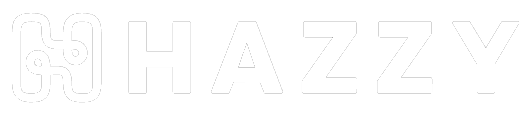
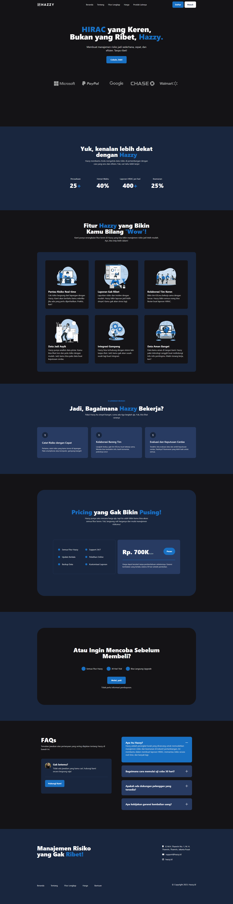
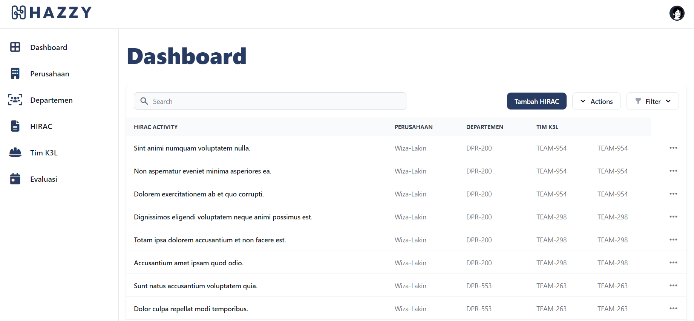
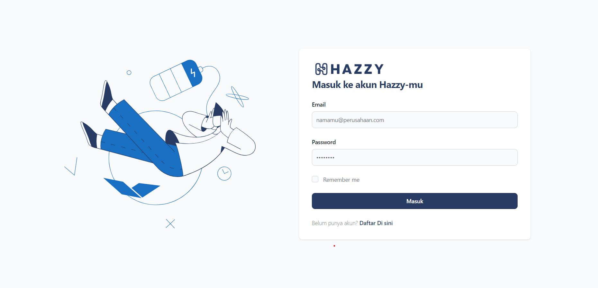
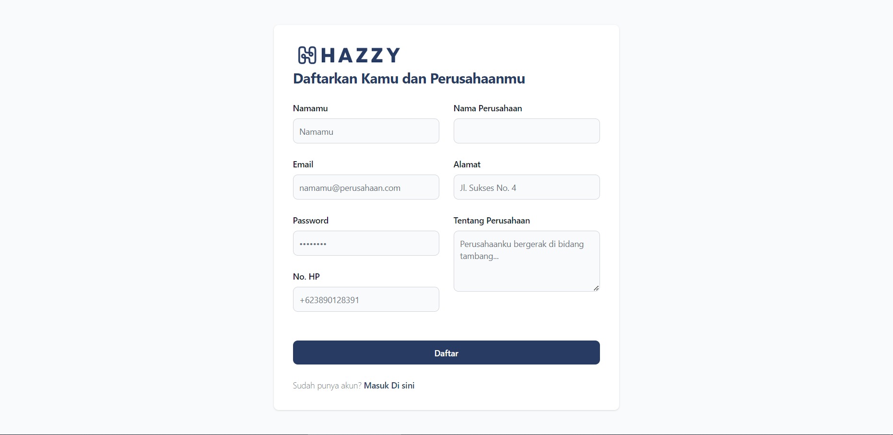
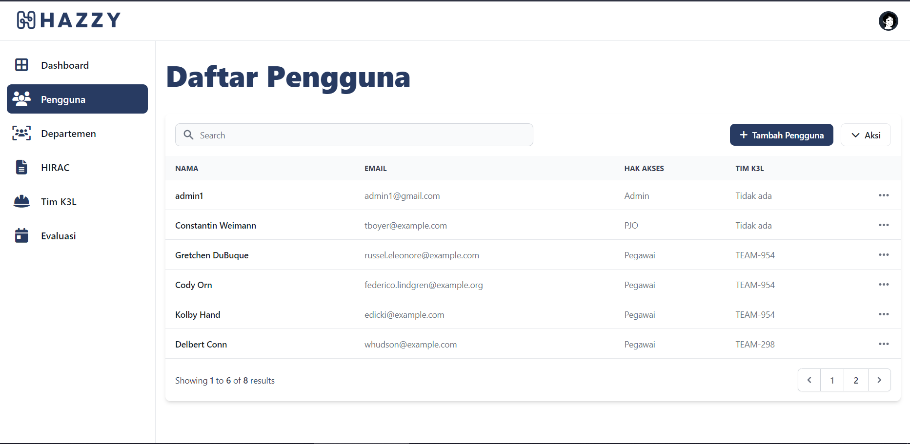
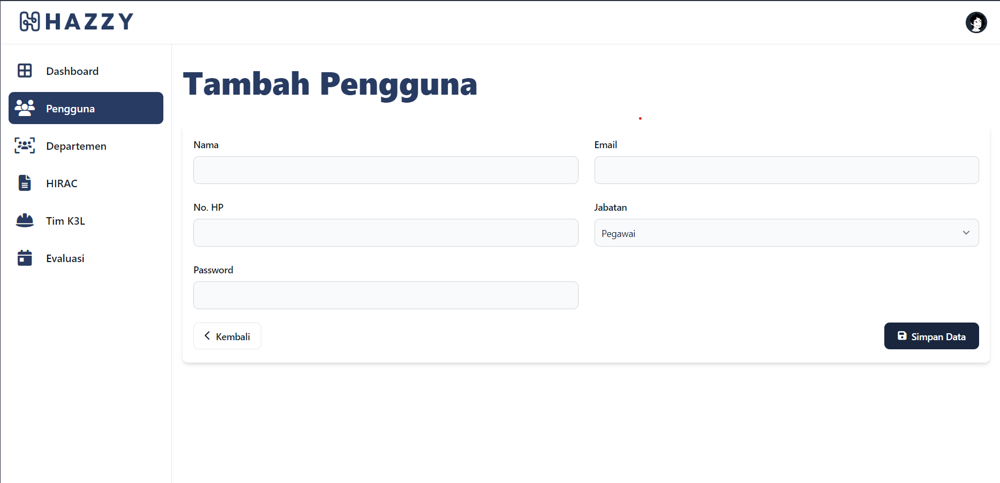
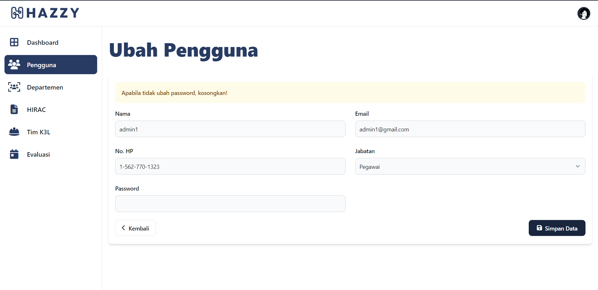

<!-- PROJECT LOGO -->
 

  

  <h3 align="center">Hazzy</h3>

  

    Sistem Pelaporan dan Evaluasi HIRADC pada K3L Tambang
     
  

## Credentials
Email: admin1@gmail.com
Password: 123123

<!-- ABOUT THE PROJECT -->
## Screenshot

### POSTTEST 1

### POSTTEST 2

### POSTTEST 3

#### LOGIN

#### REGISTER

#### USER READ

#### USER CREATE

#### USER EDIT

